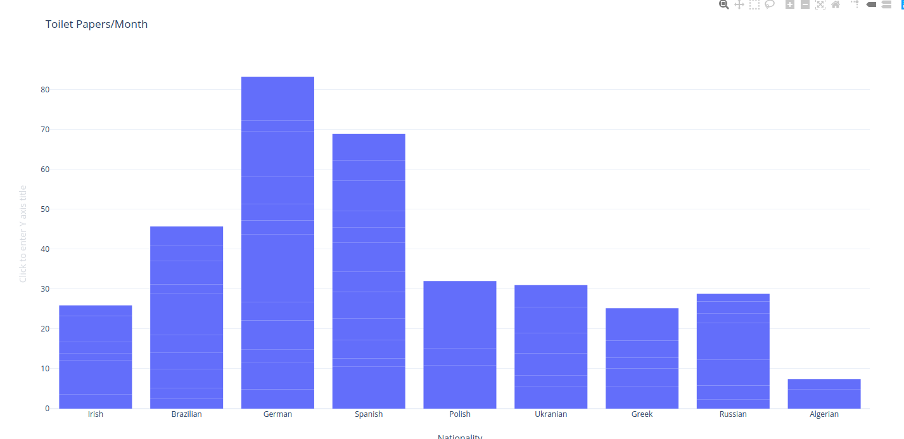

## Abstract

In the time of Crisis like the outbreak of pandemies like COVID-19, the rush for toilet paper in Countries where people suffer from _Fremdangst_ increases rapidaly. In this paper we try to understand the toilet paper usage in times like this, try to predict the usage along the time as much as find a co-relation between the concept of _Fremdangst_ and usage of toilet paper

## Samples

Because not enough of research in this area exists, we opted to conduct a research, giving a form to be filled in to 78 random people around the World. The question askes were

- How many Toilet papers rolls are used in your home per Month
- How many people live in your home
- Nationality


```
| nationality | number_of_people | paper_roles_month |
|-------------|------------------|-------------------|
| Russian     | 2                | 2.34              |
| Brazilian   | 4                | 4.17              |
| Portuguese  | 6                | 1.13              |
| German      | 1                | 8                 |
```

## Results

We first analyse the number of rolls per nationality:




## Conclusion

Lorem Ipsum is simply dummy text of the printing and typesetting industry. Lorem Ipsum has been the industry's standard dummy text ever since the 1500s, when an unknown printer took a galley of type and scrambled it to make a type specimen book. It has survived not only five centuries, but also the leap into electronic typesetting, remaining essentially unchanged. It was popularised in the 1960s with the release of Letraset sheets containing Lorem Ipsum passages, and more recently with desktop publishing software like Aldus PageMaker including versions of Lorem Ipsum.

## References

Lorem Ipsum is simply dummy text of the printing and typesetting industry. Lorem Ipsum has been the industry's standard dummy text ever since the 1500s, when an unknown printer took a galley of type and scrambled it to make a type specimen book. It has survived not only five centuries, but also the leap into electronic typesetting, remaining essentially unchanged. It was popularised in the 1960s with the release of Letraset sheets containing Lorem Ipsum passages, and more recently with desktop publishing software like Aldus PageMaker including versions of Lorem Ipsum.